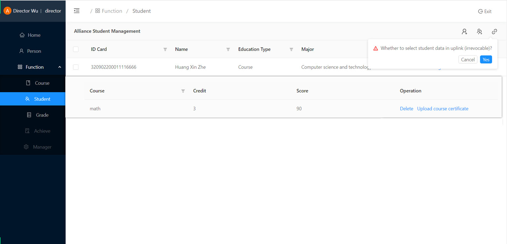
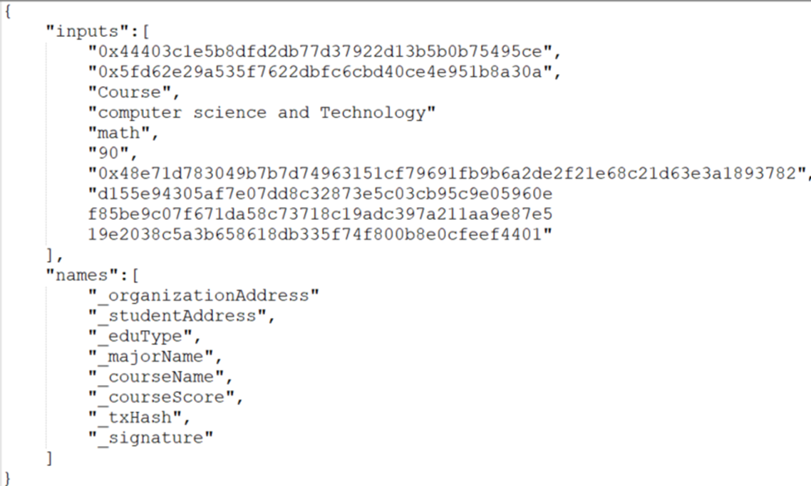
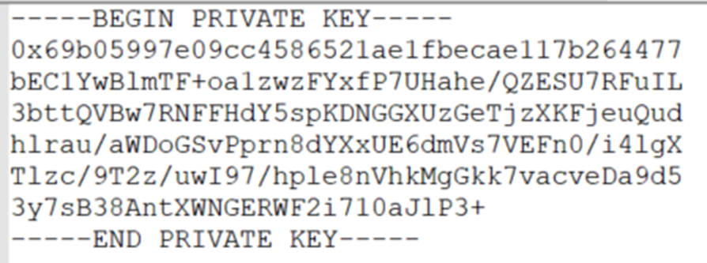
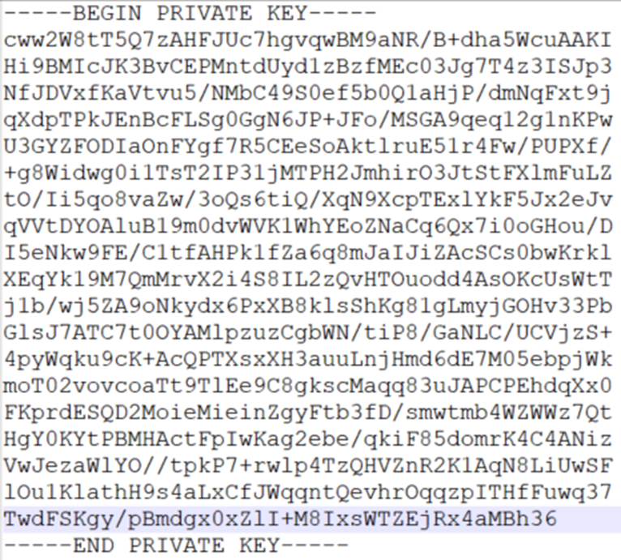

# **EduChain**

## **App and links**


## EduChain monitoring platform


## **Student**


## **Organization**



## **Checker**




## **Key** 

**ECDSA key**



**Proxy re-encryption key**




## Videos

https://youtu.be/upDUfN2HTdw


## **Techs**
* Springboot
* FISCO BCOS
* Mybatis
* MySQL
* Redis
* Shiro
* Jwt
* Druid
* Swagger
* Vue


###  The project

The main idea of this project is to connect scientific research institutes, training institutions and employers of lifelong education archives to jointly maintain students' lifelong learning files and protect the privacy of students' files based on asymmetric encryption and proxy re-encryption. Any unauthorized checker cannot decipher the lifelong education archives.

### Main features
* Web version(For student)
  * Register user
  * Lifelong education archives
  * Authorization checker
* Web version(For mechanism admin)
  * Create a new teacher  and dean account
* Web version(For dean)
  * Create new majors and courses
* Web version(For teacher)
  * Submit the achievement to the blockchain
  * Review achievement 
* Web version(For checker)
  * review student's lifelong education archives


### How to run this project?

_**To run Backend**_

**1.install fisco and webase to ubuntu system [FISCO BCOS](https://github.com/FISCO-BCOS/FISCO-BCOS) and  [WeBase](https://github.com/WeBankBlockchain/WeBASE)** 

**2.deploy four contracts on webase**

```
system.contract.personSolAddress=0x84f47c79bc94939da32365b4a1d4f1961ec87ee9
system.contract.eduRecordSolAddress=0xa510704341585d41bdaa852967c8e8dd504ef835
system.contract.courseSolAddress=0x79285afd82120fa9b3f63d434bd7bc8bc64ef138
system.contract.achieveSolAddress=0x6fce93b0b10d09e7454cdd93c87da66fc72c0463
```

**3.configure blockchain certificate link, contract address, MySQL database and Redis account password**

**4.configure system-manager's email in the yaml file**

**5.Start the three Springboot services of allianceService, checkService and personService in IDEA**

_**To run Frontend**_

The Vue projects of alliance, checker and person are started as follows

```npm
$ npm install
$ npm run serve
```
